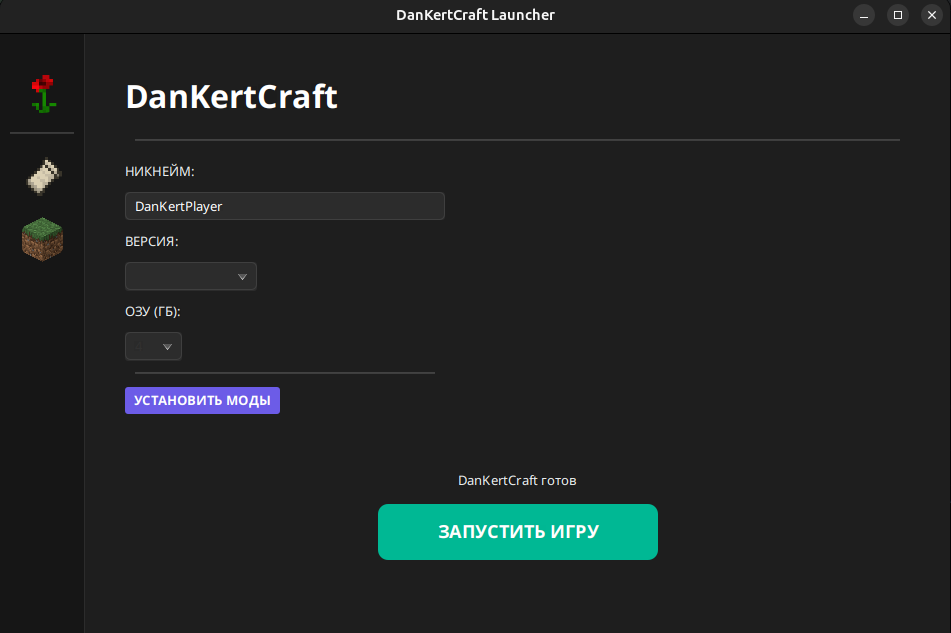

# 🚀 DanKertCraft Core
> A high-performance, modular Minecraft Launcher Engine built with JavaFX.

[](https://www.oracle.com/java/)
[](https://openjfx.io/)
[](LICENSE)

**DanKertCraft Core** is not just another launcher; it's a lightweight SDK designed for developers who want to build their own Minecraft distribution platforms. It handles the heavy lifting of version management, asset synchronization, and process execution.

---

## ✨ Key Features

* **⚡ High-Speed Synchronization**: Optimized engine for downloading Minecraft assets and libraries.
* **🧩 Fabric Support**: Native support for Fabric loader out of the box.
* **💻 Modern UI**: Discord-inspired sidebar navigation with a sleek dark theme.
* **🛡️ Multi-Runtime Management**: Automatically handles Java Runtime environments for different game versions.
* **🐧 Linux First**: Designed and tested on Linux (Ubuntu/Debian), fully cross-platform.

## 📸 Preview



## 🛠️ Technology Stack

| Component | Technology |
| :--- | :--- |
| **Language** | Java 17 |
| **GUI Framework** | JavaFX 17 |
| **Build Tool** | Maven |
| **Graphics** | Custom PNG Assets |

## 🚀 Quick Start

### Prerequisites
* JDK 17 or higher
* Maven 3.6+

### Installation
1. Clone the repository:
   ```bash
   git clone git@github.com:dan-kert/DanKertCraft.git
