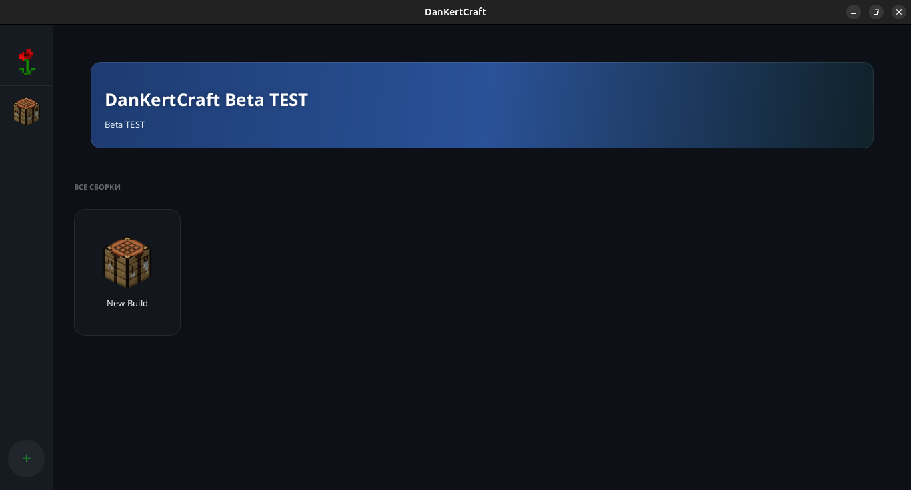
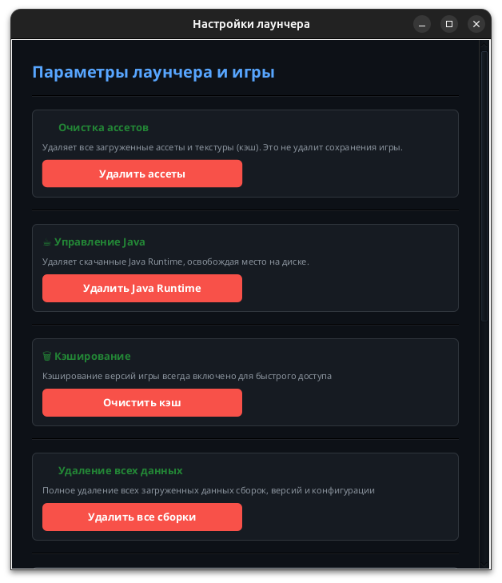
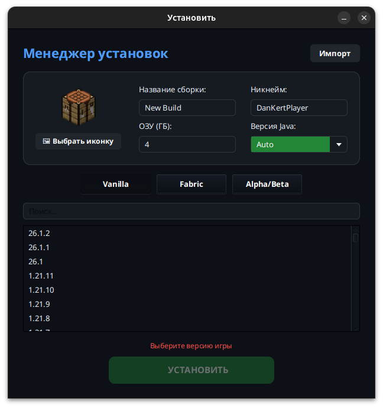

# DanKertCraft - Minecraft Launcher 
Minecraft лаунчер с поддержкой Windows и Linux.

## Скриншоты

|            Главное меню            |             Настройки              |              Загрузка              |
|:----------------------------------:|:----------------------------------:|:----------------------------------:|
|  |  |  |

### 🛠 Стек

  
  
  

---

## ✨ Основные возможности
- ✅ **Кроссплатформность**: Windows и  Linux
- ✅ **Скачивание Java**: скачивание нужной версии
- ✅ **Поддержка модификаций**: интеграция с Modrinth
- ✅ **Управление версиями**: поддержка разных версий Minecraft
- ✅ **Локализация**: русский и английский языки

## ✨ Key Features
- ✔ Cross-platform: Windows and Linux support.
- ✔ Java Downloader: Automatically downloads the required Java version.
- ✔ Mod Support: Seamless integration with Modrinth.
- ✔ Version Management: Support for all Minecraft versions.
- ✔ Localization: Available in Russian and English.

## 📋 Требования
- Java 17+
- JavaFX 17+
## 🔗 Полезные ссылки

- [Java Downloads](https://jdk.java.net/)
- [JavaFX SDK](https://gluonhq.com/products/javafx/)
- [Minecraft Launcher](https://launcher.mojang.com/)

### 📥 Загрузка
* 📦 **[Скачать для Linux (.deb)](https://github.com/Dan-Kert/DanKertCraft/releases/download/v1.0/dankertcraft.deb)**
* 🪟 **[Скачать для Windows (.exe)](https://github.com/Dan-Kert/DanKertCraft/releases/download/v1.0/DanKertCraft.exe)**

---

**Версия**: 1.0  
**Дата**: 22 апреля 2026
